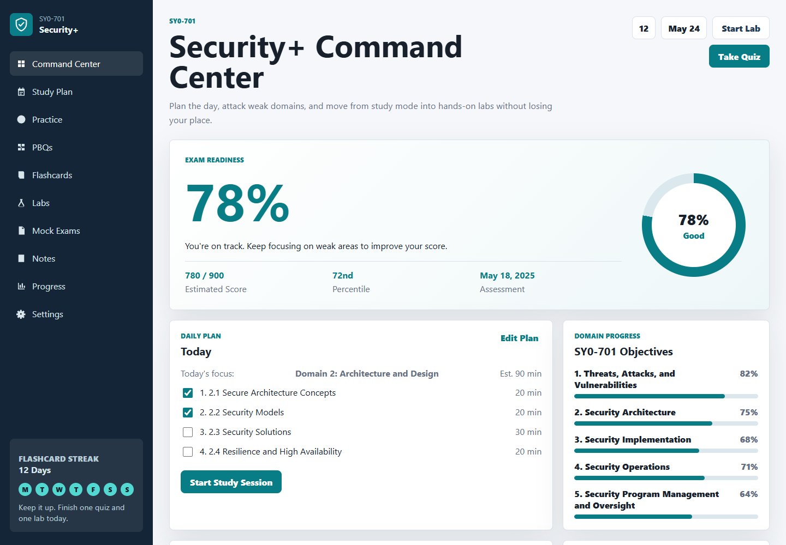
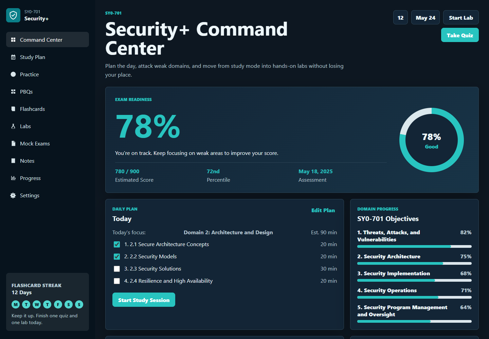
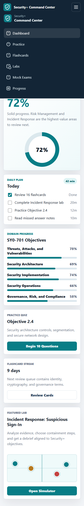

# Security+ Command Center

A responsive static study application for CompTIA Security+ SY0-701 prep. No build step, no server required.

## Features

- **Dashboard** — readiness score computed from your actual quiz performance, daily plan, domain progress, and quick-access shortcuts
- **Practice Quizzes** — 300-question SY0-701 bank with answer feedback, score tracking, random mode, and explanations
- **PBQ Simulator** — performance-based question tasks for network zones, access controls, and incident response
- **Flashcards** — spaced repetition with confidence tracking and daily streak counter
- **Lab Simulator** — guided incident response scenario with evidence, checklists, hints, scoring, and debrief
- **Study Plan** — 10-item checklist covering all exam objectives, persisted across sessions
- **Mock Exams** — exam-format reference with question counts and time limits
- **Notes** — editable study notes
- **Progress Tracking** — all quiz results, lab scores, PBQ scores, and flashcard reviews are saved in localStorage
- **Dark Mode** — toggle in Settings, persisted across sessions
- **Responsive** — desktop sidebar and mobile hamburger menu

## Run Locally

Open `index.html` in a browser. That's it.

## Run with Docker

```bash
docker compose up -d
```

Serves the app on [http://localhost:8080](http://localhost:8080) via nginx.

## Deploy

Static files only — works on GitHub Pages, Netlify, Vercel, Cloudflare Pages, or any web host. A GitHub Actions workflow is included for automatic deployment to GitHub Pages on push to `main`.

## Data Storage

All progress is stored in the browser's localStorage. No accounts, no server, no tracking. Your data stays in your browser. Use the Settings page to export/import your progress as JSON.

## Screenshots

| Desktop (Light) | Desktop (Dark) | Mobile |
|---|---|---|
|  |  |  |

## License

MIT
