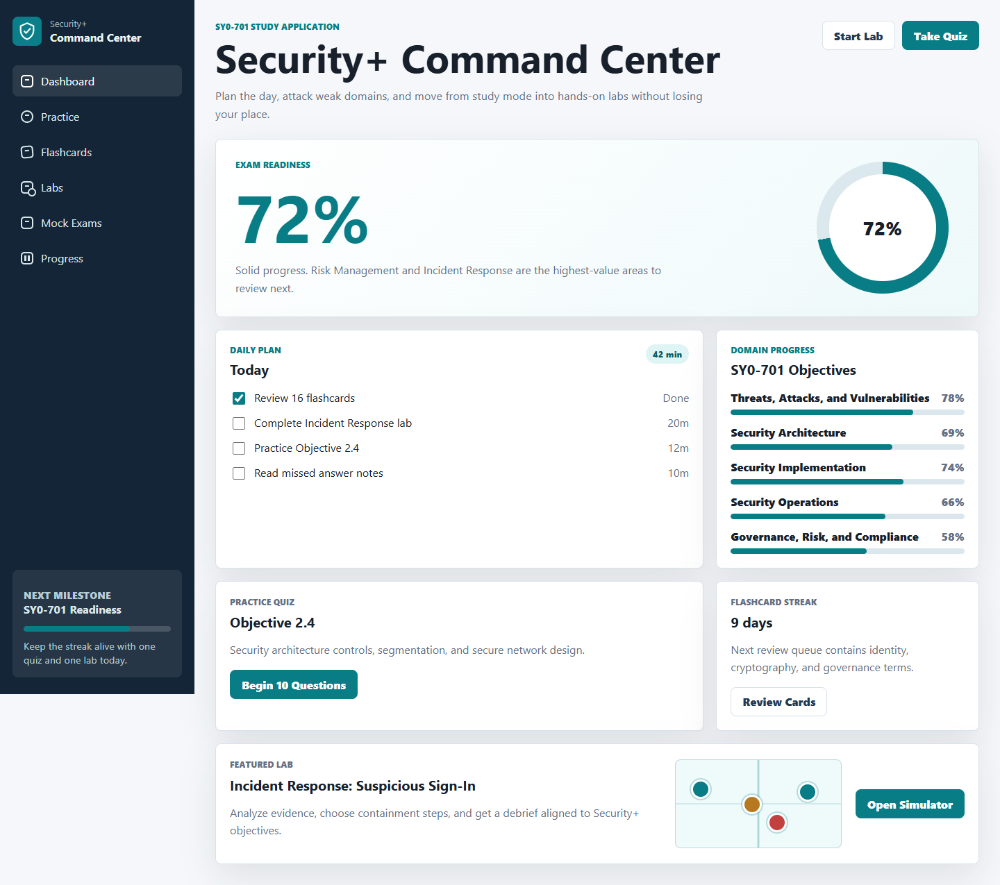
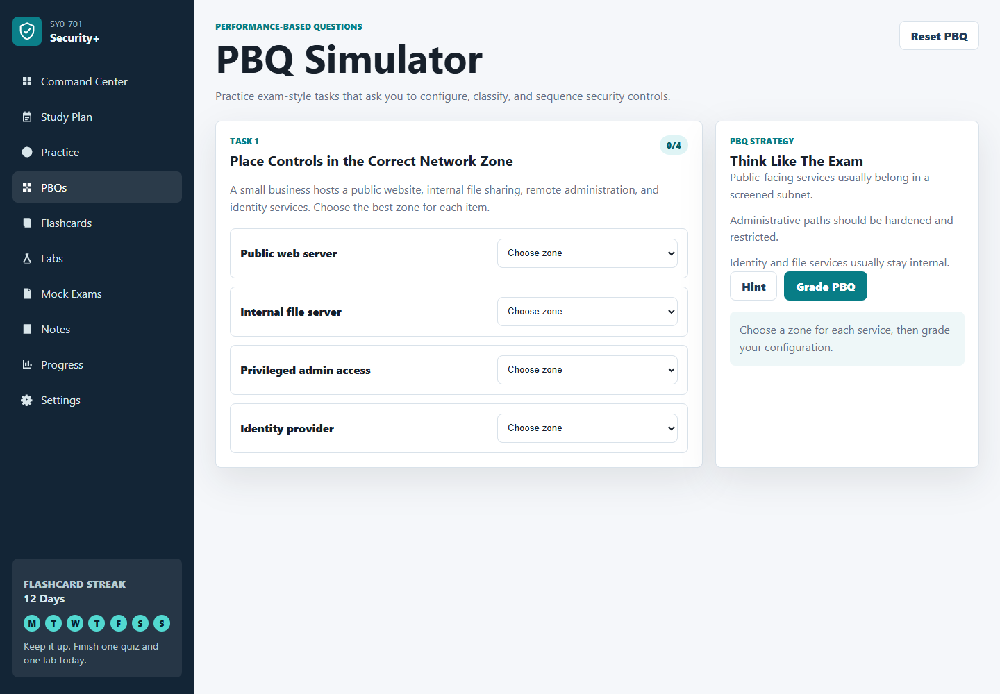
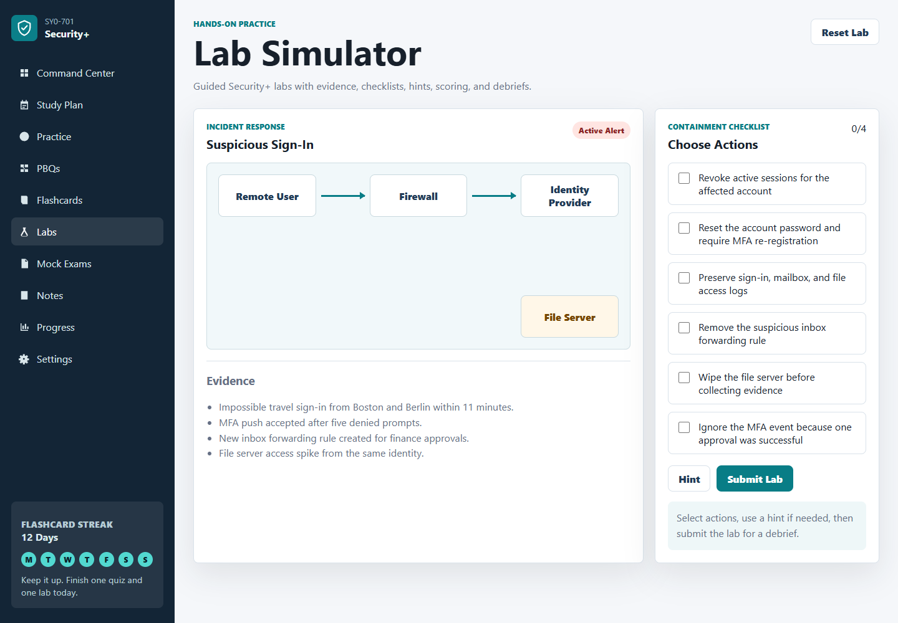
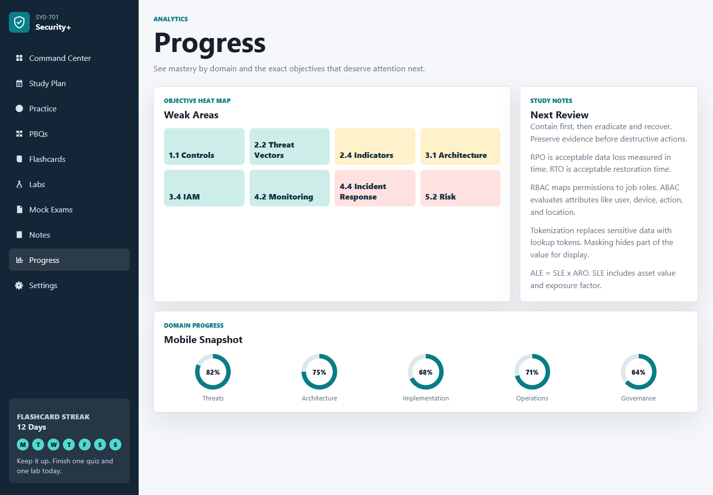
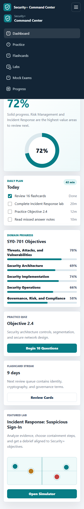

# Security+ Command Center

A responsive, dark-mode-only static study application for CompTIA Security+ SY0-701 prep. It runs entirely in the browser: no build step, no app server, no accounts, and no database.

Live test site: <https://alove4tech.github.io/secplus-study/>

## Features

- **Command Center dashboard** — readiness score, daily study plan, domain progress, review queue count, streak tracking, and quick-access cards.
- **Adaptive practice quizzes** — a generated SY0-701 question bank currently containing **536 questions** derived from exam-objective templates, with answer feedback, explanations, confidence selection, random question mode, weak-area review, and selectable 5/10/15/20-question sessions.
- **PBQ simulator** — **8 performance-based scenarios** for network zones, firewall rules, incident-response phases, certificate types, wireless authentication, risk treatment, SOC log triage, and cloud shared responsibility.
- **Flashcards** — 6 quick recall cards with flip interaction, confidence tracking, and daily streak updates.
- **Lab simulator** — **8 guided labs** with evidence, action checklists, hints, scoring, and debrief feedback: suspicious sign-in, malware containment, access-control audit, network segmentation, phishing triage, cloud storage exposure, rogue wireless AP, and vulnerability prioritization.
- **Study plan** — 10 persisted checklist items covering all five SY0-701 domains.
- **Mock exams** — timed 90-question full exam and 25-question weak-area drill with CompTIA-style 100–900 scaled scoring, pass/fail result, domain breakdown, and exam history.
- **Notes** — built-in high-yield study reminders stored with progress and displayed in the Notes and Progress views.
- **Progress analytics** — objective heat map, domain progress, next-review prompts, quiz/lab/PBQ/exam history, and settings stats.
- **Export/import/reset** — back up progress as JSON, restore a JSON backup, or reset all browser-local progress from Settings.
- **Responsive UI** — desktop sidebar plus mobile hamburger navigation.

## What It Does Not Include

- No login or user profiles.
- No password protection.
- No server-side sync.
- No telemetry or tracking.
- No light theme; the interface is intentionally dark-mode only.

## Run Locally

Because the app is static, you can open `index.html` directly in a browser.

For a local HTTP server, run one of these from the repository root:

```bash
python3 -m http.server 8000
```

Then open <http://localhost:8000>.

## Run with Docker

```bash
docker compose up -d --build
```

The Docker setup serves the static app with nginx on <http://localhost:8080>. The nginx config also provides SPA fallback routing and basic security headers.

Stop it with:

```bash
docker compose down
```

## Deploy

Static files only — works on GitHub Pages, Netlify, Vercel, Cloudflare Pages, nginx, or any web host that can serve HTML/CSS/JS.

This repo includes a GitHub Actions workflow that deploys the repository contents to GitHub Pages when `main` is pushed. The current test deployment is:

<https://alove4tech.github.io/secplus-study/>

## Data Storage

All study data is stored in the current browser's `localStorage` under:

```text
secplus-study-progress-v4
```

Stored data includes quiz results, quiz sessions, flashcard confidence, lab scores, PBQ scores, study-plan checklist state, streak days, review queue, exam results, and notes.

Because storage is browser-local:

- progress is not shared between different devices, browsers, or users;
- clearing site data/browser storage will remove progress;
- GitHub Pages visitors do not see each other's progress;
- export progress from Settings if you want a backup or want to move progress to another browser.

## Tests and Checks

The app does not use npm or a bundler. Source-level regression checks live in `tests/securityplus_source_checks.py`.

Run:

```bash
python3 tests/securityplus_source_checks.py
node --check app.js
```

## Screenshots

Screenshots are stored in `docs/`.

| Overview | PBQs | Labs | Progress | Mobile |
|---|---|---|---|---|
|  |  |  |  |  |

> Note: older screenshot assets may still exist in `docs/`, including historical light-theme captures, but the current app is dark-mode only.

## License

MIT
